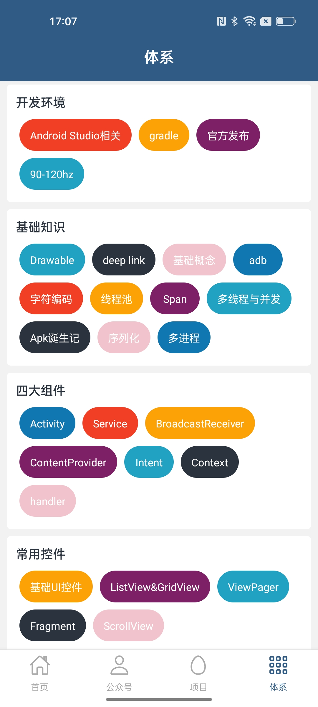
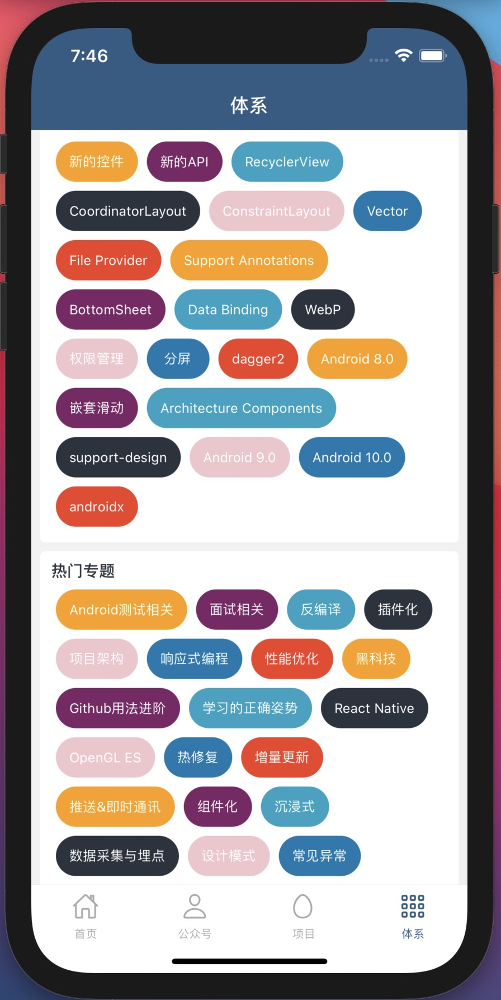

# RN-RTK-Query-Demo

## 说明
- 不是一个功能完整的App，只是测试[RTK Query](https://redux-toolkit.js.org/rtk-query/overview)的Demo
- TypeScript
- React Hooks

## API
 - [wanAndroid](https://github.com/hongyangAndroid/wanandroid)

## Android 截图：

|  |  |  |  |
| --- | --- | --- | --- |

## iOS 截图：

|  |  |  |  |
| --- | --- | --- | --- |

## 主要功能

- 首页、公众号、项目、体系；
- 登录功能；
- 收藏功能：添加收藏、取消收藏；
  

## 主要开源框架

 - [react-native](https://github.com/facebook/react-native)
 - [redux](https://github.com/reduxjs/redux)
 - [react-redux](https://github.com/reduxjs/react-redux)
 - [redux-toolkit](https://github.com/reduxjs/redux-toolkit)
 - [react-navigation](https://github.com/react-navigation/react-navigation)
 - [react-native-webview](https://github.com/react-native-community/react-native-webview)
